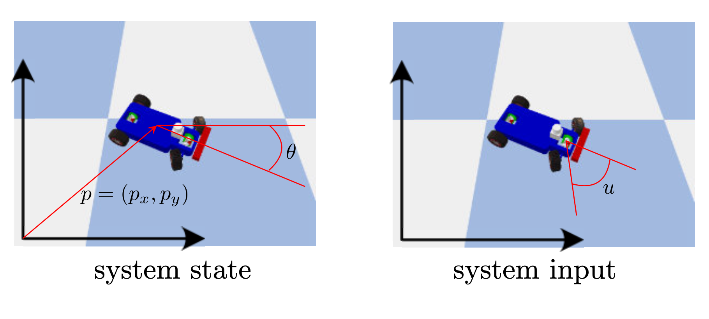

# ControlTheory
## David Alvear
## Study Material of Linear Control Systems

Principles and methods for modeling, analysis, and feedback design for linear systems

Key Topics:

1.	**Introduction to Linear Systems**:

    •	Comparison of nonlinear and linear systems.

    •	Time-invariant vs. time-varying systems.

    •	State-space representation of systems.

    

2.	**Linear Algebra and Frequency Domain Analysis**:

    •	Fundamentals of vector spaces, matrix operations, eigenvalues, and eigenvectors.

    •	Laplace and z-transforms as tools for system analysis.

3.	**State Equation Solution and System Linearization**:

    •	Existence and uniqueness of solutions to state equations.
    
    •	Transfer functions, Taylor series expansions, and the linearization of nonlinear systems.

    
    

4.	**Stability Analysis**:

    •	Concepts of internal, exponential, marginal, and Lyapunov stability.

    •	Stability in nonlinear systems using linearization techniques.

    

5.	**Controllability and Observability**:

    •	Exploration of controllability/observability gramians and matrices.

    •	The rank condition, PBH test, and concepts of reachability and detectability.

6.	**System Realization**:

    •	Criteria for system realizability and techniques for minimal realization.

7.	**Feedback Control Design**:

    •	Techniques for state feedback stabilization and eigenvalue assignment.

    •	Observer design and methods for output and dynamic feedback control.

    
    

8.	**Optimal and Robust Control**:

    •	Introduction to the Linear Quadratic Regulator (LQR) and Linear Quadratic Gaussian (LQG).

    •	Overview of $H_2$ and $H_{\infty}$ robust control methods.

    

    

9.	**Computational Methods in Control Design**:

    •	Application of convex optimization and linear matrix inequalities in feedback control design.

10.	**Applications of Linear System Theory**:

    •	Practical applications in networked control systems and robotics, emphasizing the integration of control and estimation techniques.

    
    
    

